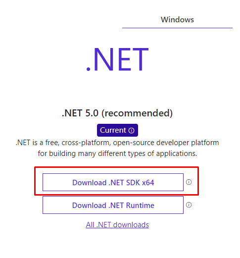

# Aviasales Test Task

Simple Rest Api service with one GET query /flights/:id

## Installation

Install last .NET SDK from [dotnet] 



After install https certs using command 
```sh
dotnet dev-certs https --trust
```

#### Building

Run command in terminal from folder Avia.Flight.Service

```sh
dotnet run
```

#### Testing

```sh
https://localhost:5001/swagger/index.html
```

```sh
https://localhost:5001/flights/1
```

Or in PowerShell terminal 

```sh
curl -UseBasicParsing https://localhost:5001/flights/1
```


[//]: # (These are reference links used in the body of this note and get stripped out when the markdown processor does its job. There is no need to format nicely because it shouldn't be seen. Thanks SO - http://stackoverflow.com/questions/4823468/store-comments-in-markdown-syntax)

   [dotnet]: <https://dotnet.microsoft.com/download>
